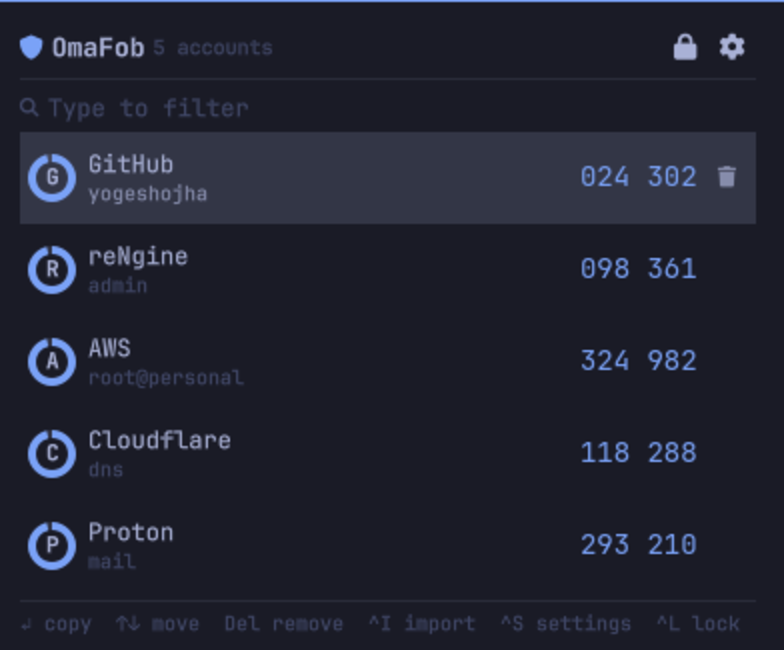
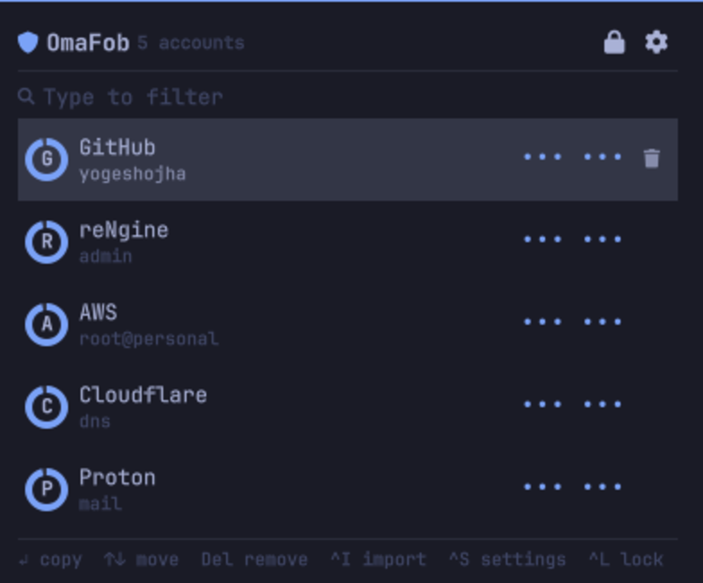

# OmaFob

Two-factor codes in the [Omarchy](https://omarchy.org/) bar. Import every
account from Google Authenticator in one scan.



Not a login guard for Omarchy. It replaces the authenticator app on your
phone. Omarchy only.

Keybind, type `gh`, Enter. The code is on your clipboard, wiped 30 seconds
later.

## Install

```bash
omarchy plugin add https://github.com/yogeshojha/omafob.git --enable
```

```bash
sudo pacman -S --needed gnupg wl-clipboard zbar grim slurp
```

Keybind, in `~/.config/hypr/bindings.conf`:

```
bindd = SUPER SHIFT, O, OmaFob, exec, omarchy-shell yogeshojha.omafob toggle
```

## Import

Google Authenticator: `⋮` → Transfer accounts → Export accounts. One QR holds
every account you pick.

- **Camera**: `Ctrl+W`, hold the phone up to the webcam.
- **Screen**: `Ctrl+I`, drag a box over the QR.
- **Paste**: an `otpauth://` link, or a path to a QR image.

Re-importing the same export is safe. Accounts already stored are skipped.

## Keys

| Key | |
|---|---|
| any letter | filter the list |
| `Enter` | copy the selected code |
| `↑` `↓` | move |
| `Backspace` / `Ctrl+U` | edit or clear the filter |
| `Del` | remove an account |
| `Ctrl+I` | scan the screen |
| `Ctrl+W` | scan from the camera |
| `Ctrl+S` | settings |
| `Ctrl+L` | lock |
| `Esc` | clear the filter, then close |

Letters go to the filter.

## Settings

`Ctrl+S`, or `Setup > Plugins`.

| | |
|---|---|
| Privacy mode | codes stay masked in the panel, default off |
| Countdown ring | ring around the bar icon, default off |
| Clear clipboard after | default 30 seconds |
| Auto-lock vault | default off |
| Group digits | `418 293` instead of `418293` |

Privacy mode shows every account as `••• •••` and never reveals a code. `Enter`
still copies. For screen sharing and open offices.



## Security

- Vault: `gpg --symmetric`, AES-256, SHA-512, at
  `~/.local/share/omafob/vault.gpg`, mode `0600` in a `0700` directory.
- The passphrase reaches gpg on its own fd, never `argv`. `--no-symkey-cache`.
- The helper holds the secrets. The shell receives codes and expiry times.
- Copies use `wl-copy --sensitive`. Codes stay out of clipboard history.
- QR images are never written to disk. `grim` pipes into `zbar`, the camera is
  decoded inside the helper. There is no camera preview.
- Children carry `PR_SET_PDEATHSIG`. A killed helper releases the camera.
- Deleting an account deletes `vault.gpg.previous` with it.

Plugins run unsandboxed inside `omarchy-shell`, and the helper runs as you.
While the vault is unlocked, anything running as your user can ask it for
codes. The encryption covers the vault at rest.

## HOTP

Counter-based accounts import and show a `COUNTER` tag. Codes for them are not
generated yet.

## Command line

```bash
ln -s ~/.config/omarchy/plugins/yogeshojha.omafob/omafob ~/.local/bin/omafob
```

```bash
omafob status                   # where the vault is
omafob list                     # stored accounts
omafob code github              # one code
omafob scan                     # import from the screen
omafob camera                   # import from the webcam
omafob add <link-or-image>      # import a link or QR image
omafob remove github            # delete an account
omafob passwd                   # change the passphrase
```

`--vault <path>` for a vault elsewhere.

## Development

```bash
python3 test/test_twofa.py
python3 test/test_security.py
ruff check .
qmllint -I /usr/share/omarchy/shell *.qml
omarchy plugin validate .
```

`Panel.qml` holds the views and the keyboard model, `BarSlot.qml` the bar item,
`AccountRow.qml` a row, `VaultController.qml` the helper process and the
countdown, `Model.js` the pure helpers, `twofa/` the helper.

The helper speaks line-delimited JSON on stdin. Each request carries a `seq`
that comes back on the reply. Account ids go in `id`.

Saving under `~/.config/omarchy/plugins/` reloads the shell and re-locks the
vault. A QML compile error is cached; run `omarchy-restart-shell` after fixing
one.

## Remove

```bash
omarchy plugin remove yogeshojha.omafob
```

The vault stays. `rm -rf ~/.local/share/omafob` removes it too.

MIT
